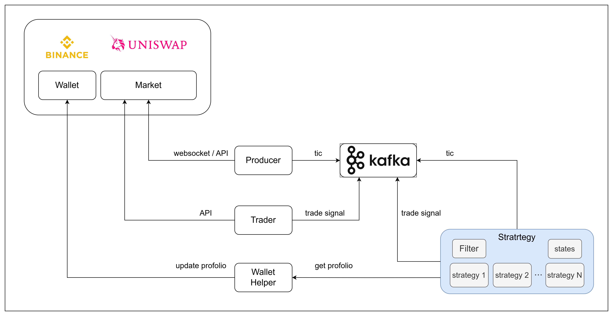

# Quantitative Trading and Backtesting System



## 📚 Documentation

- [📖 文件導覽](docs/README.md) — 文件地圖與閱讀指引（從這裡開始）
- [執行摘要](docs/00-executive-summary.md) — 關鍵發現、回測框架設計要點、建議行動順序
- [專案總覽](docs/01-project-overview.md) — 系統組成、模組地圖、資料流、測試現況
- [現有問題與解決方案](docs/02-issues-and-solutions.md) — 問題優先級總表與處理順序
- [回測框架設計與服務拆分](docs/03-backtest-framework-and-service-split.md) — 完整回測框架規劃、服務邊界建議


## 🚀 New: Live Trading on Binance Testnet

**实盘交易功能已完成！** 现在支持在Binance测试网上进行自动交易。

### 快速开始
```bash
# 1. 测试API连接
python3 test_both_testnets.py

# 2. 启动实盘交易（需要Kafka数据流）
python3 live_trading.py

# 3. 查看实时日志
tail -f logs/live_trading.log
```

📖 详细说明请参考 [快速启动指南](QUICKSTART.md) 和 [交易系统设置](TRADING_SETUP.md)

---

## Summary
This project is a modular quantitative trading and backtesting system featuring:

- **🔥 Live Trading**: Automated trading on Binance Spot and Futures testnet with detailed logging
- **Kafka Integration**: Real-time data streaming and communication between services using Apache Kafka.
- **DEX & CEX Support**: Interfaces for both decentralized (DEX) and centralized (CEX, e.g., Binance) exchanges.
- **Strategy Executor**: Flexible framework to register, manage, and execute multiple trading strategies across products.
- **Reinforcement Learning (RL) Strategies**: Support for advanced RL-based trading strategies.
- **Producer Service**: Streams live market data from Binance to Kafka topics for downstream consumption.

## Installation (using `uv`)

1. Install [uv](https://github.com/astral-sh/uv) (if not already installed):

```sh
curl -Ls https://astral.sh/uv/install.sh | bash
```

2. Install dependencies:

```sh
uv pip install --system pyproject.toml
```

## Running with Docker Compose

To start all services (Kafka, Kafka UI, and the producer):

```sh
docker compose up -d
```

- The producer service will stream Binance market data to Kafka.
- Kafka UI is available at [http://localhost:8080](http://localhost:8080) for monitoring topics and messages.

## Stopping Docker Compose

To stop all running services:

```sh
docker compose down
```
---

For more details, see the source code and comments in each module.