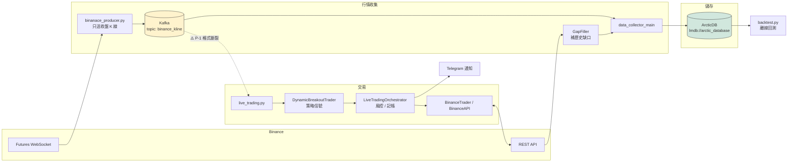

# 專案總覽（Project Overview）

> 更新日期：2026-07-03
> 相關文件：[02-issues-and-solutions.md](02-issues-and-solutions.md)、[03-backtest-framework-and-service-split.md](03-backtest-framework-and-service-split.md)

## 這個專案是什麼

一套針對 **Binance USDT 永續合約（Futures PERPETUAL）** 的量化交易系統，包含：

1. **行情收集**：WebSocket 訂閱全市場 1m K 線 → Kafka → ArcticDB 持久化
2. **實盤交易（live trading）**：消費 Kafka 行情 → 策略產生信號 → 下單至 Binance（testnet / production）
3. **回測**：讀取歷史 K 線，離線模擬策略績效（目前為簡易版，完整框架規劃見文件 03）

主力策略為 `DynamicBreakoutTrader`（動態突破 + ATR/ADX/成交量過濾）。

## 系統組成與資料流



> ⚠️ 虛線：producer 已改新訊息格式，`live_trading.py` 尚未跟上（問題 P-1，見文件 02），目前這條路徑實際上不通。

## 模組地圖

### 進入點（repo 根目錄）

| 檔案 | 用途 | 狀態 |
|------|------|------|
| `live_trading.py` | 實盤交易主程式（Kafka → 策略 → 下單） | 使用中，**但與新版 producer 訊息格式不相容**（見文件 02 問題 P-1） |
| `backtest.py` | 簡易離線回測（ArcticDB → 策略 → 報酬統計） | 可用但功能陽春 |
| `src/data_source/data_collector_main.py` | 資料收集服務進入點（gap-fill + Kafka → ArcticDB） | 本分支新增 |
| `app.py`、`kafka_consumer.py`、`mock_trading.py`、`live_trading_old.py`、`test_refactoring.py`、`write_binance_data.py`、`test_both_testnets.py` | 舊版 / 實驗性腳本 | 多數為遺留待清理（issue S-4） |

### `src/` 套件

| 目錄 | 內容 |
|------|------|
| `src/client/` | `binance_api.py` — Binance REST API 低階封裝（spot + futures，簽名、下單、查詢） |
| `src/trader/` | `base_trader.py`（抽象介面）、`binance_trader.py`（實作，含 warmup 用 kline 查詢、24h 量過濾） |
| `src/strategies/` | `dynamic_breakout_atx.py`（主策略，含 `TradingSignal`、`warmup_with_history`）、`base_strategy.py`、`strategy_executor.py`（多策略註冊框架，與主流程未整合）、其他實驗策略（moving_average、rl_strategy、naive…） |
| `src/orchestrator/` | `live_trading_orchestrator.py`（`PortfolioTracker` + `LiveTradingOrchestrator`：信號處理、下單、風控、績效摘要、Telegram）、`startup_coordinator.py`（重啟後與交易所對帳） |
| `src/data_source/` | `binanace_producer.py`（WS → Kafka，僅送收盤 K 線、完整 OHLCV）、`gap_filler.py`（REST 補缺口，分頁）、`data_collector.py`（啟動補缺 + 消費 Kafka 寫入）、`create_backtest_database.py`（`ArcticDBOperator`） |
| `src/data_process/` | `kline_storage.py`（型別化的 ArcticDB 包裝，key = `{SYMBOL}_{INTERVAL}`）、`data_structure.py`（`BinanceTick`）、`get_data.py` / `write_data.py`（Binance 官方 zip 歷史資料下載與匯入） |
| `src/backtset/` | ⚠️ 目錄名拼錯（backtest）。`wallet.py`（回測用錢包/資產模型）、`market.py`。與 `backtest.py` 的整合不完整 |
| `src/eval/` | `evaluator.py` — 交易指標計算（勝率、回撤、平均報酬） |
| `src/config/` | `trading_config.py` — 環境變數載入的 pydantic 設定（策略參數、Kafka、風控、log） |
| `src/event/` | `telegram_bot.py` — Telegram 通知 |
| `src/fin_index/`、`src/rlenv/`、`src/market/` | 技術指標實驗、RL 環境等，未接入主流程 |

## 儲存

- **ArcticDB**（`lmdb://arctic_database`）：
  - 舊 library `BinanceSpot`：以 symbol 為 key 的 Spot 歷史資料（`backtest.py` 使用）
  - 新 library `klines`：`{SYMBOL}_{INTERVAL}` key（`DataCollector` / `KlineStorage` 使用）
  - ⚠️ 兩套 schema 並存，回測與新資料層尚未打通（見文件 02 問題 P-2）
- **Kafka**：topic `binance_kline`，訊息格式（新版）：
  `{symbol, interval, open_time(ms), open, high, low, close, volume, close_time(ms)}`
- **JSON 檔**：策略狀態持久化（`docs/superpowers/plans/2026-03-19-strategy-state-persistence.md`，計畫中/部分實作於 worktree）

## 部署

- `docker-compose.yml`：Kafka + Kafka UI（http://localhost:8080）+ producer
- live trading / data collector 目前以本機 python 執行

## 測試現況（2026-07-03 實測）

```
75 passed, 12 failed, 2 skipped, 1 error
```

- 新資料層測試（kline_storage、gap_filler、data_collector、startup_coordinator）全數通過
- 失敗者集中在遺留模組：`test_wallet`、`test_asset`、`test_naive_strategy`、`test_state_mahcine`、`test_strategy_executor`、`test_rl_strategy` 等 — 對應程式碼已與測試脫節（見文件 02 問題 P-6）

## 現行分支工作

- `feature/data-infrastructure`（本分支）：資料基礎建設四階段（BinanceTick 統一、producer 修正、GapFiller + DataCollector、StartupCoordinator）— 依 `docs/superpowers/plans/2026-04-18-data-infrastructure.md` 已完成並提交
- `.worktrees/strategy-state-persistence`：策略狀態持久化（S-1）進行中

## 既有問題追蹤

歷史問題清單（S/T/D/A/B 編號系統）在根目錄 `issue.md`；本次整理後的彙總與解法見 [02-issues-and-solutions.md](02-issues-and-solutions.md)。
