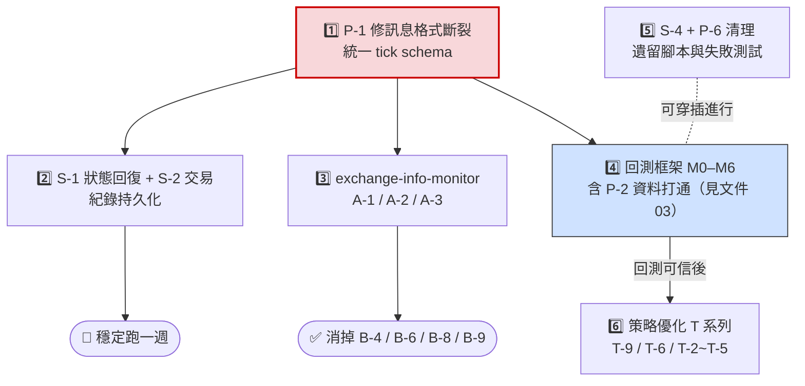

# 現有問題彙總與解決方案

> 更新日期：2026-07-03
> 來源：`issue.md`（S/T/D/A/B 編號）+ 本次程式碼盤點新發現（P 編號）
> 相關文件：[01-project-overview.md](01-project-overview.md)、[03-backtest-framework-and-service-split.md](03-backtest-framework-and-service-split.md)

## 優先級總表

| 優先級 | 問題 | 一句話說明 |
|--------|------|-----------|
| 🔴 P0 | P-1 | producer 新格式與 live_trading 舊格式斷裂，**live trading 目前收不到任何行情** |
| 🔴 P0 | P-2 | 回測讀舊 Spot 資料庫，實盤跑 Futures — 回測結果對實盤沒有代表性 |
| 🟠 P1 | P-3 / issue 全類 | 回測框架不完整（無手續費、無資金模擬、無組合層）→ 見文件 03 |
| 🟠 P1 | B-4/B-6/B-8/B-9、A-1~A-3 | 下單前未過濾無效 symbol / 槓桿限制，靠 error handler 收尾 |
| 🟡 P2 | P-6、S-4 | 12 個測試失敗 + 大量遺留腳本，維護噪音大 |
| 🟡 P2 | S-1、S-2 | 狀態回復與交易紀錄持久化（已有計畫，部分實作中） |
| 🟢 P3 | T-9、T-10、T-11 | 策略邏輯問題（買賣時間尺度不一致、損益計算不含手續費） |

---

## 新發現問題（本次盤點）

### P-1【嚴重】Kafka 訊息格式斷裂：producer 已改版，live_trading 未跟上

**現象**：
- `binanace_producer.py` 已改為只送**收盤 K 線**、新格式：
  `{symbol, interval, open_time, open, high, low, close, volume, close_time}`
- `live_trading.py:210` 仍讀 `raw_data['timestamp']`（字串格式 `%Y-%m-%d %H:%M:%S`）
- `DynamicBreakoutTrader.on_tick()`（`dynamic_breakout_atx.py:206`）仍讀 `data['close_price']`

**後果**：live_trading 消費每筆訊息都會 `KeyError: 'timestamp'` → 落入 warning log 被丟棄。**目前 producer + live_trading 一起跑時完全不會有交易**。這也連帶影響 B-7（時區問題的根源就是字串 timestamp）。

**解法**：
1. 定義唯一的 tick schema：以 `src/data_process/data_structure.BinanceTick`（或新 `KlineTick` dataclass）為準，全系統統一使用 `open_time`（UTC ms）
2. `live_trading.py` 訊息解析改為新格式：`timestamp = datetime.fromtimestamp(tick['close_time']/1000, tz=timezone.utc)`
3. `on_tick` 的 data dict 統一鍵名（`close` 或 `close_price` 擇一，建議在消費端做一次 adapter 轉換，策略內部不再直接依賴原始訊息格式）
4. 加一條整合測試：用 producer 的實際輸出格式餵 live_trading 的解析函式，防止再度 drift

### P-2【嚴重】回測資料與實盤市場不一致（Spot vs Futures）

**現象**：`backtest.py` 讀 ArcticDB library `BinanceSpot`（Spot 歷史資料、以 symbol 為 key）；實盤交易的是 Futures PERPETUAL，而新的 `DataCollector` 寫入的是 library `klines`（key = `{SYMBOL}_{INTERVAL}`）。

**後果**：回測用的價格 / 成交量分佈與實盤不同市場；且新收的 Futures 資料回測根本讀不到。

**解法**：回測改讀 `KlineStorage`（`klines` library）；歷史 Futures 資料用 `GapFiller` 或 Binance 官方 zip（`get_data.py` 改抓 futures/um 路徑）回填。舊 `BinanceSpot` library 標記 deprecated。

### P-3 `backtest.py` 的模擬缺陷（完整解法見文件 03）

- `BaseWallet` 建立、入金後**從未被使用**——策略自己在 `trade_records` 記 earn，沒有資金約束、沒有部位大小、可無限開倉
- 無手續費、無滑價（對應 T-11）
- `total_earn = sum(earn)` 是單利加總，非複利資金曲線；無最大回撤、Sharpe 等指標（`Evaluator` 存在但沒接上）
- 每 symbol 獨立回測，無組合層資金管理（對應 T-6/T-7）
- `ThreadPoolExecutor` 跑 CPU-bound 的逐筆迴圈，受 GIL 限制，多執行緒幾乎無加速（應改 multiprocessing 或單迴圈多 symbol 事件驅動）

### P-4 `src/backtset/` 目錄拼字錯誤且半廢棄

`backtset` → 應為 `backtest`。其中 `wallet.py` / `market.py` 與 `backtest.py` 整合不完整（wallet 沒真的參與模擬）。**解法**：在文件 03 的新框架落地時整併：新框架建 `src/backtest/`，把 `wallet.py` 中可用的 `Asset`/`Coin` 抽象搬過去或淘汰，舊目錄刪除。

### P-5 同名概念重複實作，績效計算有三套

- `src/eval/evaluator.py`（回測指標）
- `src/orchestrator/live_trading_orchestrator.py` 的 `PortfolioTracker`（實盤指標）
- 策略內部 `total_earn` / `trade_records`（策略自算）

三者演算法與口徑不一致（含不含手續費、單利/複利），對應 T-10/T-11 的根源。**解法**：抽出單一 `accounting` 模組（見文件 03），策略只發信號不記帳。

### P-6 測試債：12 failed + 1 error

失敗集中在 `test_wallet`、`test_asset`、`test_naive_strategy`、`test_state_mahcine`、`test_strategy_executor`、`test_rl_strategy`、`test_smoke_timeseries::test_get_last_timestamp_exact_ms`。多數是介面已改、測試沒更新的遺留測試。

**解法**（配合 S-4 清理）：
1. 先判定對應模組去留：要留的模組修測試；要刪的模組連測試一起刪
2. `src/` 內的測試檔（`src/strategies/test_strategy.py`、`src/fin_index/test_index*.py`、`src/data_source/test_arcticdb.py`、`src/eval/test_perf.py`）移到 `tests/` 或刪除
3. CI（或至少 pre-commit）跑 `pytest`，讓測試不再默默腐化

### P-7 ArcticDB（LMDB backend）多程序寫入風險

未來 data-collector 常駐寫入、backtest 同時讀取、GapFiller 可能單獨執行。LMDB 對多程序併發寫的支援有限。**解法**：制定「單一寫入者」原則——只有 data-collector 程序可寫 `klines` library（GapFiller 作為其內部元件），回測只讀。若未來需要多寫入者，換 TimescaleDB/QuestDB。

---

## `issue.md` 未解問題彙總（含建議解法）

### 系統類（S）

| 編號 | 問題 | 建議解法 |
|------|------|---------|
| S-1 | 狀態回復（strategy state + gap replay） | 已有完整計畫 `docs/superpowers/plans/2026-03-19-strategy-state-persistence.md`，在 worktree 進行中；優先完成，這是「穩定跑一週」的前提 |
| S-2 | 交易紀錄持久化 | 在 `_execute_buy`/`_execute_sell` 成交後寫入 `trade_records` 表（SQLite 起步即可，schema 已在 `docs/architecture-data-backtest.md` 定義）；這同時是回測對照分析的資料來源 |
| S-4 | 移除非必要檔案 | 見 P-6 解法；建議一次 PR 刪除 `live_trading_old.py`、`app.py`、`kafka_consumer.py`、`test_refactoring.py` 等 |
| S-5 | 區分 offline backtest / online backtest / production | 用 `TRADING_MODE=backtest\|paper\|testnet\|production` 統一切換，核心是 Trader 介面的三種實作（見文件 03） |
| S-7 | reset account 確保初始條件一致 | `reset_for_online_backtest` 已存在，將其納入 `TRADING_MODE=paper` 的啟動流程 |
| S-9 | Sharpe/Sortino 等進階指標 | 併入新回測框架的 `report` 模組，一次實作、回測與實盤共用 |
| S-10 | 新幣上架自動訂閱 | 併入 exchange-info-monitor 服務（見文件 03 服務拆分） |
| S-12 | 獨立 Kafka consumer 腳本 | `data_collector_main.py` 已大致涵蓋此需求，確認後可關閉 |

### 架構類（A）— 共同根因：交易所狀態只在 init 查一次

A-1（槓桿限制）、A-2（上下架）、A-3（24h 交易量）三者解法相同：

**建立一個獨立的 `exchange-info-monitor` 元件**（先做成 trading engine 內的背景 thread，之後可拆成服務）：
- 每 N 分鐘拉 `exchangeInfo` + `leverageBracket` + `ticker/24hr`
- 維護一份「可交易 symbol 白名單 + 各 symbol 槓桿上限」的共享狀態（thread-safe dict 或發佈到 Kafka topic `exchange_meta`）
- `LiveTradingOrchestrator.handle_signal` 下單前查白名單 → 一次解掉 B-6/B-8/B-9，並在 setup 槓桿時 clamp 到上限 → 解掉 B-4/-2027

### Bug 類（B）未修復項

| 編號 | 問題 | 建議解法 |
|------|------|---------|
| B-4 | 槓桿 20x 不符 config 1x | 啟動時對每個 symbol 顯式呼叫 `POST /fapi/v1/leverage` 設定；並以 exchange-info-monitor 的 bracket 上限 clamp |
| B-6/B-8/B-9 | 無效 symbol / 已下架 / 特殊字元 symbol 下單失敗 | 白名單前置過濾（同 A-2）；`-1022` 簽名問題另需對 symbol 做 URL encode 或直接排除非 ASCII symbol |
| B-7 | 時區混用 | 修 P-1 時一併解決：全系統只用 UTC ms epoch，顯示層才轉時區 |
| B-10 | Margin insufficient（根因是策略倉位周轉率低） | 屬策略問題，對應 T-9；短期可加「可用保證金 < 開倉需求時跳過並記 log」避免 error 噪音 |

### 策略類（T）

策略問題（T-1 ~ T-9）建議**等回測框架完成後再處理**——這正是回測框架的價值：T-9（SELL 後立即重 BUY）、T-6（固定比例持倉）、T-2~T-5（進場條件）都需要可信的回測來驗證修改是否真的更好。目前只有 T-10/T-11（損益計算正確性）值得先做，因為它是「衡量工具」本身的正確性，做法併入 P-5 的統一 accounting 模組。

### 部署類（D）

| 編號 | 問題 | 建議解法 |
|------|------|---------|
| D-1 | docker run 連不上 Kafka | `compose` 有預設 network 使 `kafka:9092` 可解析；`docker run` 需 `--network quant_default`。寫入 D-4 的文件即可 |
| D-2 | producer log 頻率 | 已改為 `logging.debug` 每筆 + 建議加每分鐘 INFO 彙總（symbol 數、訊息數） |
| D-3 | WS 斷線重連 | `run()` 外層 while 已有重連骨架，但 `websockets.connect` 失敗本身沒有 backoff；補上 exponential backoff + 重連次數 log |
| D-6 | Kafka 未就緒 crash | compose 加 `healthcheck` + `condition: service_healthy`，producer 端加 retry with backoff（兩者都做，防禦縱深） |

---

## 建議處理順序

1. **P-1**（格式斷裂）— 不修，其他一切免談；半天內可完成
2. **S-1 完成 + S-2**（狀態回復、交易紀錄持久化）— 達成「穩定跑一週」目標
3. **A-1/A-2/A-3 的 exchange-info-monitor** — 一次消掉 B-4/B-6/B-8/B-9 的錯誤噪音
4. **P-2 + 回測框架**（文件 03）— 你最想做的事，前置依賴是 P-1 的統一 schema
5. **S-4 + P-6 清理** — 可穿插進行，降低維護成本
6. **策略優化（T 系列）** — 等回測框架可信後進行
