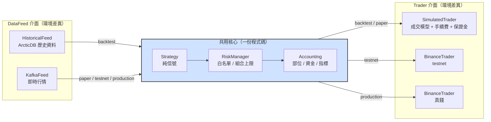
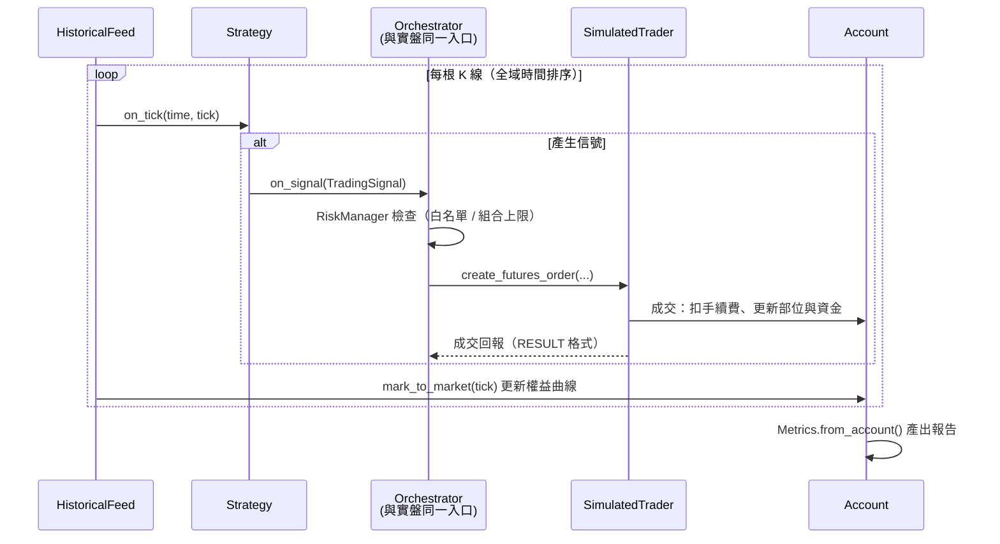
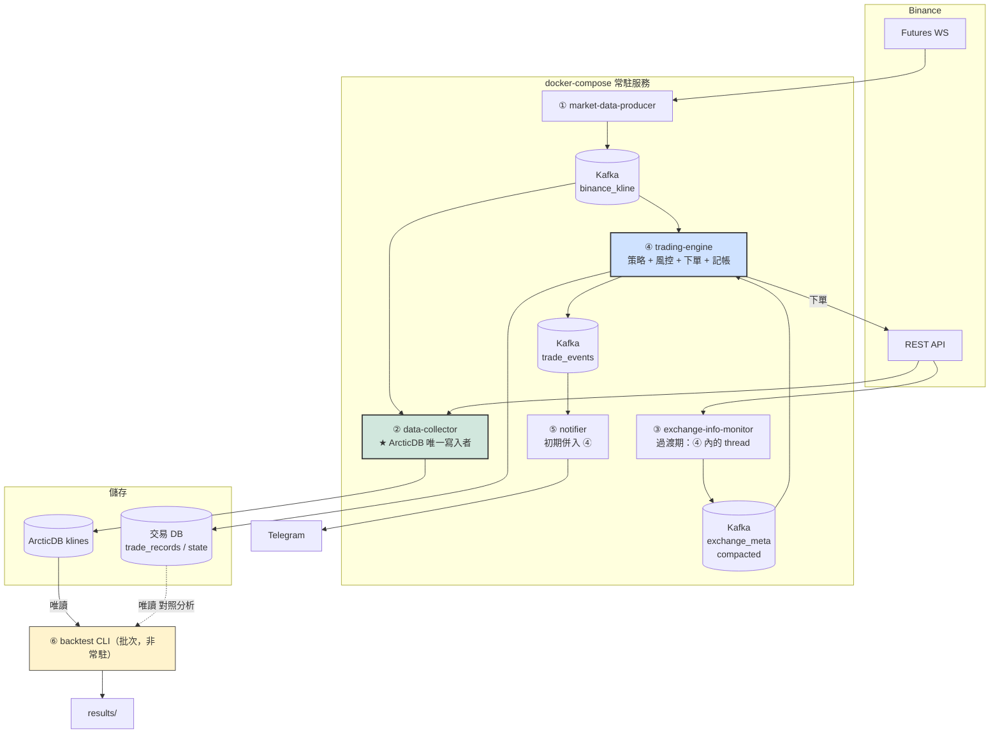

# 完整回測框架設計 與 服務拆分建議

> 更新日期：2026-07-03
> 相關文件：[01-project-overview.md](01-project-overview.md)、[02-issues-and-solutions.md](02-issues-and-solutions.md)、`docs/architecture-data-backtest.md`（2026-03-21 的三模組討論，本文件是其落地版）

---

## Part 1：完整回測框架

### 1.1 現況與目標差距

現有 `backtest.py` 的本質是「策略信號重播器」：逐筆餵 `on_tick`，加總策略自記的 `earn`。缺少：

| 缺口 | 影響 |
|------|------|
| 無資金模擬（wallet 建了沒用） | 無法回答「10,000 USDT 本金實際會變多少」 |
| 無手續費 / 滑價 | 高頻進出策略的回測報酬嚴重高估（T-11） |
| 無組合層 | 每 symbol 各自 100% 資金，無法驗證 T-6/T-7 的資金管理 |
| 無成交模型 | 假設信號價必成交，忽略保證金不足、最小下單量等實盤限制（B-10 在回測看不到） |
| 指標不完整 | 無資金曲線、最大回撤、Sharpe（S-8/S-9 只在實盤端做了一半） |
| 資料是 Spot | 與實盤 Futures 市場不一致（P-2） |
| 與實盤程式路徑不同 | 回測驗過的邏輯不等於實盤跑的邏輯 |

### 1.2 核心設計原則：一套核心，三種環境

這直接回答 S-5（區分 offline backtest / online backtest / production）。**策略、風控、記帳邏輯只寫一份**，環境差異被隔離在兩個介面後面：



| `TRADING_MODE` | DataFeed | Trader | 用途 |
|----------------|----------|--------|------|
| `backtest` | HistoricalFeed | SimulatedTrader | 離線回測、參數搜索 |
| `paper` | KafkaFeed | SimulatedTrader | 端到端流程驗證（現有 `reset_on_start` 併入此模式） |
| `testnet` | KafkaFeed | BinanceTrader(testnet) | 交易所整合測試 |
| `production` | KafkaFeed | BinanceTrader | 實盤 |

好處：回測跑過的每一行決策程式碼，就是實盤跑的那一行。Paper mode 幾乎免費獲得——它只是「HistoricalFeed 換成 KafkaFeed 的回測」。

### 1.3 模組設計

新目錄 `src/backtest/`（同時淘汰拼錯的 `src/backtset/`）：

```
src/backtest/
    config.py        # BacktestConfig：symbols、時間範圍、interval、初始資金、費率、策略參數
    data_feed.py     # HistoricalFeed：多 symbol 時間對齊的事件迭代器
    sim_trader.py    # SimulatedTrader(BaseTrader)：成交模型、手續費、保證金
    engine.py        # BacktestEngine：事件主迴圈
    report.py        # 績效計算與輸出（JSON / CSV / console）
src/accounting/
    account.py       # Account：部位、資金、權益曲線（回測與實盤共用）
    metrics.py       # 指標計算（整併 src/eval/evaluator.py 與 PortfolioTracker 的統計）
```

#### DataFeed（`data_feed.py`）

```python
class HistoricalFeed:
    """從 KlineStorage 讀多 symbol K 線，依 open_time 全域排序後逐筆吐出。"""
    def __init__(self, storage: KlineStorage, symbols, interval, start_ms, end_ms): ...
    def verify_completeness(self, gap_filler: GapFiller) -> None:
        """回測前檢查缺口，有缺先補（architecture-data-backtest.md 衝突 2 的解法）。"""
    def __iter__(self) -> Iterator[KlineTick]:
        """heapq 合併各 symbol 的時間序列 → 保證跨 symbol 時間單調遞增。"""
```

關鍵點：
- **多 symbol 單一時間軸**。組合層資金管理（T-6/T-7）要求所有 symbol 共用一條資金曲線，因此不能像現在每 symbol 獨立跑，必須以時間排序的單一事件流驅動
- 讀取來源是 `KlineStorage`（`klines` library、Futures 資料），解掉 P-2
- 資料完整性檢查複用 `GapFiller`，不重寫

#### SimulatedTrader（`sim_trader.py`）

實作既有 `BaseTrader` 介面，讓 `LiveTradingOrchestrator` 無感替換：

```python
class SimulatedTrader(BaseTrader):
    """模擬成交：市價單以下一根 open（或當根 close ± slippage）成交，
    扣 taker fee，檢查可用保證金與 minNotional。"""
    def __init__(self, account: Account, fee_rate=0.0005, slippage_bps=2): ...
    def create_futures_order(...):   # 回傳與 BinanceAPI RESULT 模式相同結構的 dict
    def get_balance(...):            # 從 Account 讀
    def get_futures_positions(...):  # 從 Account 讀
```

成交模型第一版刻意簡單（市價單 + 固定滑價 + taker fee），但**必須**模擬：
1. 手續費（T-11）
2. 可用保證金檢查（讓 B-10 的「保證金被佔滿」在回測就看得到）
3. `minQty` / `minNotional`（實盤真實限制）

#### Account 與 Metrics（`src/accounting/`）

這是解 P-5（三套績效計算）的核心。單一記帳來源：

```python
class Account:
    balance: float                      # 可用 USDT
    positions: dict[str, Position]      # symbol → size, entry_price, entry_time
    equity_curve: list[(ts, equity)]    # 每根 K 線 mark-to-market
    trades: list[TradeRecord]           # 每筆平倉紀錄（含 fee）

class Metrics:  # 從 Account 一次算出所有指標
    total_return, max_drawdown, sharpe, sortino,
    win_rate, profit_factor, avg_holding_minutes,
    fee_ratio, num_trades, max_consecutive_losses, ...
```

- 回測：`SimulatedTrader` 直接寫 `Account`
- 實盤：成交回報寫同一個 `Account` 結構並持久化（同時完成 S-2 交易紀錄持久化、S-8/S-9 指標統一）
- 策略內的 `total_earn` / `trade_records` 自記帳**移除**，策略回歸純信號（T-10 自然解決）

#### BacktestEngine（`engine.py`）

```
for tick in feed:                                  # 全域時間排序
    strategy = strategies[tick.symbol]             # per-symbol 策略實例
    strategy.on_tick(tick.time, tick)              # 只產生 signal
      └─ on_signal → orchestrator.handle_signal    # 與實盤同一個 orchestrator 入口
           └─ RiskManager 檢查（組合上限、白名單）
           └─ trader.create_futures_order(...)     # SimulatedTrader 成交
           └─ account 更新
    account.mark_to_market(tick)                   # 更新權益曲線
report = Metrics.from_account(account)
```



前置條件：`LiveTradingOrchestrator` 需小幅重構，把「Kafka 消費 + symbol 初始化 + warmup」從 `live_trading.py` 的迴圈抽進 orchestrator（或一個共用 runner），使回測與實盤走同一入口。這與修 P-1 的工作重疊，可一起做。

#### Report（`report.py`）

- console 摘要表（現有 backtest.py 的輸出保留）
- `results/{run_id}/config.json` + `trades.csv` + `equity_curve.csv` + `metrics.json` — 每次回測完整落盤，可重現、可比較
- run_id 含時間戳與策略參數 hash，供參數搜索比對

### 1.4 效能

- 全市場 ~400 symbol × 1m × 6 個月 ≈ 1 億筆事件，純 Python 逐筆會慢
- 第一階段：先求正確，單程序跑常用的 10–50 symbol 子集即可
- 第二階段：參數搜索用 `multiprocessing`（每組參數一個 process，取代現在無效的 ThreadPoolExecutor）
- 不建議一開始就上 vectorbt / backtrader：與「回測實盤同一份程式碼」的原則衝突，等策略穩定後再考慮向量化快篩 + 事件驅動精算的兩段式

### 1.5 實作里程碑

| 階段 | 內容 | 驗收 |
|------|------|------|
| M0 | 修 P-1（統一 tick schema），策略/live_trading 對齊新格式 | producer→live_trading 端到端收到行情 |
| M1 | `Account` + `Metrics`（accounting 模組），單元測試 | 手續費、權益曲線、回撤計算正確 |
| M2 | `SimulatedTrader` 實作 BaseTrader | 用 mock orchestrator 下單、成交、扣費正確 |
| M3 | `HistoricalFeed` + 完整性檢查 | 多 symbol 時間單調；缺口自動補齊 |
| M4 | `BacktestEngine` 串接（先單 symbol，後多 symbol 組合） | 同一段資料，回測結果可重現（同 config 同結果） |
| M5 | Report 落盤 + 舊 `backtest.py`/`src/backtset/` 退役 | `python -m src.backtest --config xxx.yaml` 一鍵出報告 |
| M6 | paper mode：KafkaFeed + SimulatedTrader | 即時行情下跑一天，資金曲線合理 |

---

## Part 2：服務拆分建議

### 2.1 原則

- **依「故障域」與「資料寫入權」拆，不是依程式碼模組拆。**行情收集掛了不該影響交易；回測重跑不該碰到實盤狀態
- **單一寫入者**：每份儲存只有一個服務可寫（ArcticDB/LMDB 尤其必要，見 P-7）
- 保持 monorepo + 共用 `src/` 套件，服務 = 不同進入點 + docker-compose service，**不是** microservice 化拆 repo

### 2.2 建議拆分（5 個常駐服務 + 1 個批次工具）



| # | 服務 | 對應現有程式 | 職責 | 讀 | 寫 |
|---|------|-------------|------|-----|-----|
| ① | market-data-producer | `binanace_producer.py` | WS 訂閱全市場收盤 K 線 → Kafka；斷線重連（D-3） | Binance WS | Kafka `binance_kline` |
| ② | data-collector | `data_collector_main.py` | 啟動 gap-fill + 即時寫入 | Kafka、Binance REST | **ArcticDB `klines`（唯一）** |
| ③ | exchange-info-monitor | 新增（A-1/A-2/A-3/S-10） | 定時拉 exchangeInfo / leverageBracket / 24h volume，維護白名單與槓桿上限 | Binance REST | Kafka `exchange_meta`（compacted topic） |
| ④ | trading-engine | `live_trading.py` | 消費行情 + meta → 策略 → 風控 → 下單；`TRADING_MODE` 決定 Trader 實作 | Kafka ×2 | 交易 DB（trade_records、strategy state）、Binance 下單 |
| ⑤ | notifier | `telegram_bot`（現為函式庫） | 消費 `trade_events` 發通知；初期可留在 ④ 內 | Kafka `trade_events` | Telegram |
| ⑥ | backtest | 新框架（Part 1） | 批次回測 | ArcticDB（唯讀）、交易 DB（唯讀，對照分析） | `results/` |

### 2.3 拆分理由與邊界說明

**① 與 ② 分開**：producer 是純轉發、無狀態、最容易掛（WS 斷線）；collector 有 ArcticDB 寫入狀態。分開後 producer 重啟零成本，collector 重啟走 gap-fill 自癒。這兩個現在已經是分開的，維持即可。

**③ 獨立的價值**：A-1/A-2/A-3 的共同解。用 Kafka compacted topic 發佈 symbol meta，trading-engine 只需訂閱，不用自己開輪詢 thread；未來 data-collector 也能訂閱它做新幣自動收錄（S-10）。**過渡做法**：先實作成 trading-engine 內的背景 thread（介面設計成獨立 class），等穩定後再搬出去成服務——避免一開始就多維運一個容器。

**④ trading-engine 不再細拆**：策略、風控、下單、記帳之間是同步低延遲呼叫鏈（arch.md 的分層在**程序內**用模組邊界實現即可）。拆成獨立服務會引入跨服務一致性問題（下單了但記帳服務沒收到），對單人專案是負資產。

**⑥ backtest 是工具不是服務**：跟著開發流程手動/CI 觸發，只讀不寫共享儲存，天然安全。

### 2.4 儲存分工

| 儲存 | 內容 | 寫入者 | 讀取者 |
|------|------|--------|--------|
| ArcticDB `klines` | K 線時序 | data-collector | backtest、trading-engine（warmup 可改讀本地，減少 REST 依賴） |
| SQLite→(未來 Postgres) `trading.db` | trade_records（S-2）、account snapshot、strategy state（S-1） | trading-engine | backtest（對照分析）、未來 dashboard |
| Kafka | `binance_kline`、`exchange_meta`、`trade_events` | 各 producer | 各 consumer |
| `results/` | 回測報告 | backtest CLI | 人 |

### 2.5 導入順序（配合文件 02 的優先級）

1. 現況已有 ①②，先修 P-1 讓 ①→④ 通（M0）
2. ③ 以 in-process thread 形式實作進 ④（消掉 B-4/B-6/B-8/B-9）
3. ④ 加交易 DB 寫入（S-2）與 state 持久化（S-1，已在 worktree 進行）
4. ⑥ 依 Part 1 里程碑實作
5. compose 補 healthcheck（D-6）、統一 `.env` 注入 Kafka endpoint（D-5）、README 補指令（D-4）
6. 全部穩定後再考慮把 ③⑤ 拆成獨立容器
