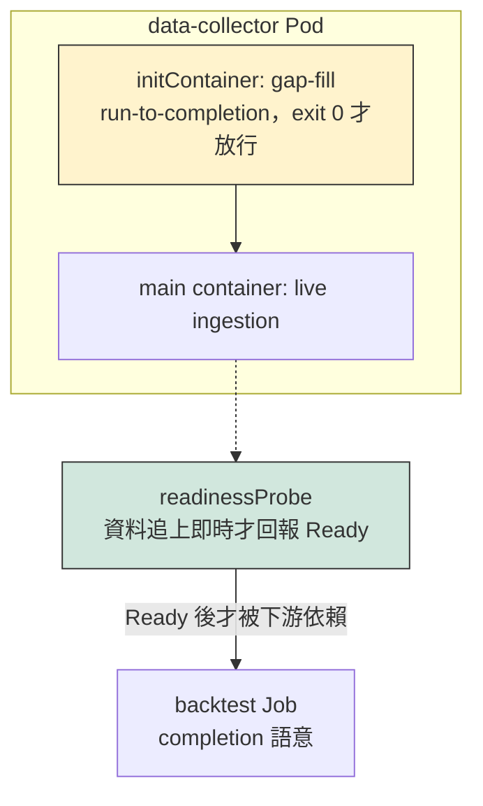
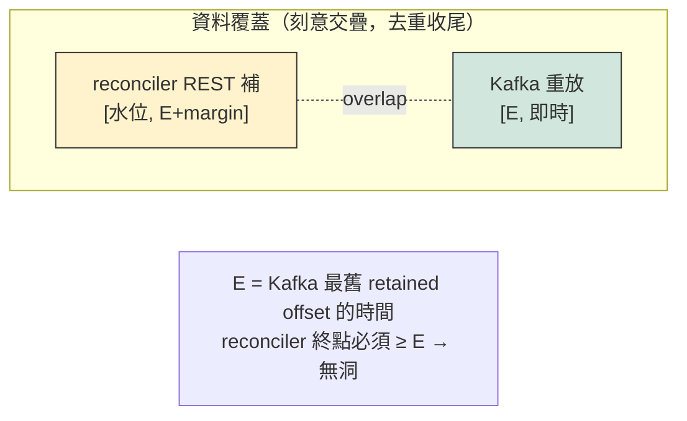
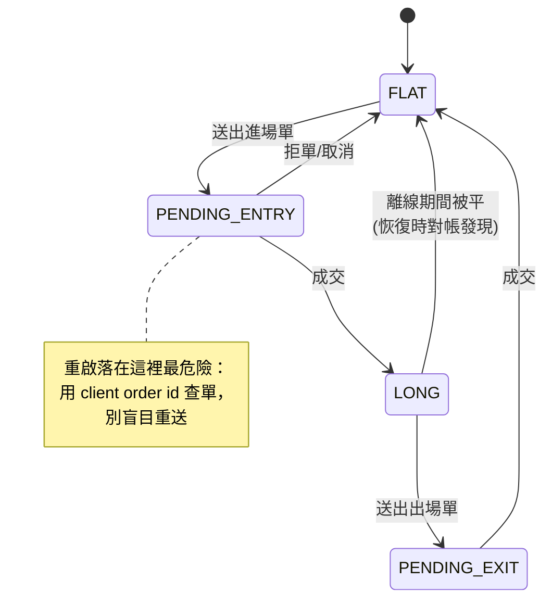
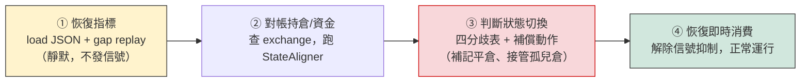

# 啟動編排與狀態回復（Startup Orchestration & State Recovery）

> 更新日期：2026-07-22
> 相關文件：[01-project-overview.md](01-project-overview.md)、[02-issues-and-solutions.md](02-issues-and-solutions.md)、[03-backtest-framework-and-service-split.md](03-backtest-framework-and-service-split.md)、`superpowers/plans/2026-03-19-strategy-state-persistence.md`
> 對應問題：P-7（單一寫入者）、D-6（Kafka 未就緒 crash）、S-1（狀態回復）、S-2（交易紀錄持久化）、S-7（reset 初始條件）

本文件記錄並展開兩個核心概念，它們都屬於「系統重啟／中斷後如何回到正確狀態」這個主題，但方向不同：

- **Part 1｜服務依賴階層**：回測依賴「完整的資料庫」，而「完整」依賴中斷後的對帳/補缺（reconciliation）先跑完。這是**服務之間的啟動順序與就緒門檻**問題。k8s 有一等公民的階級概念，docker-compose 沒有——本文確認 compose 能用哪些機制拼出等價效果，以及邊界在哪。
- **Part 2｜交易系統的狀態回復**：交易引擎是**有狀態**的，重啟後要同步恢復狀態，並判斷狀態該如何切換。這是**單一服務內部**的狀態機重建與對帳問題。

兩者的共同精神：**「就緒」不等於「行程還活著」。** 資料層的就緒是「資料完整」，交易層的就緒是「本地狀態與交易所一致」。編排工具（compose/k8s）只能保證行程活著，真正的就緒判定必須寫在應用層。

---

## Part 1：服務依賴階層——完整資料庫的就緒門檻

### 1.1 概念記錄

依賴鏈是：

```
backtest（要跑）
  └─ 依賴「完整的 klines 資料庫」
       └─ 依賴「中斷後的 reconciliation（gap-fill）完整跑完」
            └─ 依賴「Kafka 就緒 + 能連上 Binance REST」
```

問題核心：**「資料庫完整」不是一個布林的開機狀態，而是一個需要主動達成、且需要被驗證的條件。** 一個剛啟動、行程活著的 data-collector，它的 ArcticDB 可能還缺著停機期間的 K 線；此時讓 backtest 讀，得到的是有洞的資料、不可信的回測結果。

### 1.2 兩種「完整」：有界 vs 持續

先釐清一個常被混為一談的區別，因為它決定了該用哪種門檻機制：

| | backtest 需要的完整 | trading-engine 需要的完整 |
|---|---|---|
| 定義 | 某段**封閉區間** `[start, end]` 內無缺口 | 資料已**追上即時**（catch-up to now） |
| 性質 | 有界、可一次性驗證、驗證後永久成立 | 持續性、永遠在移動、只能監控 lag |
| 適合的門檻 | **一次性 gate**（job 完成語意） | **持續性 healthcheck**（就緒探針 + lag 監控） |

這個區別很重要：backtest 的完整性是可以「驗過就放行」的；trading-engine 的完整性是「隨時可能落後、要一直盯」的。兩者不該用同一種機制硬套。

### 1.3 k8s 的階級模型（對照組）

k8s 把「階級」做成一等公民，所以這件事在 k8s 很自然：



- **initContainer**：跑完（exit 0）才輪到主容器起來——天生的「先對帳再服務」。
- **Job / CronJob**：run-to-completion 語意，reconciliation 可以是一個 Job，backtest 是依賴它的另一個 Job（Argo/Airflow 更能表達 DAG）。
- **readinessProbe**：Pod 就緒前不接流量／不被下游視為可用；探針內容可以是「資料 lag < 閾值」。
- 階級是宣告式的：ordering、completion、readiness 各有原生語意。

### 1.4 docker-compose 對照：沒有階級，但能拼出等價效果

compose 沒有 initContainer / Job / probe 的一等公民概念，`depends_on` 預設也**只保證啟動順序、不保證就緒**。但 Compose Spec 有三個機制，組合起來可覆蓋大部分需求：

| k8s 概念 | compose 對應機制 | 限制 / 注意 |
|---|---|---|
| initContainer | 獨立一次性 service（`restart: "no"`）+ 下游 `depends_on: condition: service_completed_successfully` | 該 service 必須真的 exit 0；失敗會擋住下游 |
| Job（run-to-completion） | 同上，一次性 service | compose 不像 k8s 追蹤 Job 歷史，靠 depends_on 串接 |
| readinessProbe | `healthcheck` + 下游 `depends_on: condition: service_healthy` | healthcheck 是容器內指令，「資料完整」的判定要自己寫 |
| CronJob | **無原生**；靠 host cron、常駐 loop、或 ofelia 之類排程容器 | |
| Deployment ordering | `depends_on`（僅順序） | 不等就緒，除非加 `condition:` |

關鍵三機制：

1. **`condition: service_completed_successfully`** — 這是 compose 對「init container / 一次性 Job」最直接的對應。一個跑完就退出的 service，下游可以等它成功才啟動。
2. **`condition: service_healthy` + 自訂 healthcheck** — 對應「就緒探針」。適合常駐服務（如 Kafka，D-6 就是要補這個）。
3. **應用層 completeness marker** — 與編排器無關的最終防線（見 1.6）。

### 1.5 採用的模型：兩服務切分（reconciler + collector）

把 reconciliation 拆成獨立 service，讓依賴關係「看得見」、責任單一：

- **data-reconciler**：REST 補齊資料到目前的資料水位，跑完退出。
- **data-collector**：從水位開始收集後續資料，常駐。

```yaml
services:
  data-reconciler:               # 補缺、跑完退出
    command: python -m src.data_source.reconcile
    restart: "no"
  data-collector:                # 對帳完才起來即時寫入
    depends_on:
      data-reconciler:
        condition: service_completed_successfully
```

責任邊界確實乾淨。但「乾淨」帶來一個必須正視的難題：**兩者切換的接縫（seam）會不會漏資料？** 尤其秒級資料，這不是理論問題。

### 1.6 為什麼「乾淨不重疊」正好製造間隔

**在一個「現在」持續移動的時間前緣上，「乾淨不重疊」與「零間隔」不能同時成立。**

假設邊界點是 B：reconciler 補到 B、collector 從 B 開始訂閱。但訂閱有延遲、WS 只送「收盤後」的 K 線，collector 實際開始覆蓋的是 B'>B，`(B, B')` 這段就是洞。想讓 B'=B 是不可能的——你無法零延遲在那一瞬間掛上訂閱，WS 也不會回頭補你掛載期間收盤的那根。

> ⚠️ **這個 bug 已經潛伏在現有程式**：`data_collector.py:63-64` 的 consumer 是 `auto_offset_reset="latest"` 且**沒有 `group_id`**。每次 `run()` 啟動都跳到 topic 尾端，停機/啟動期間 producer 送進 Kafka 的訊息被跳過；唯一補這段的是 `startup_fill()` 的 REST 補缺。REST 補到 `T_fill`、consumer 在 `T_attach`（>T_fill）才接上 latest，中間 `(T_fill, T_attach)` 幾秒兩邊都沒收。**1m 資料通常只丟邊界那根，秒級資料穩定丟好幾根。**

秒級的殘酷之處：接縫窗口（啟動延遲幾秒）在 1s 粒度跨多根，對齊兩個端點沒有意義，你**一定**會丟點。

### 1.7 解法：重疊 + 冪等去重，讓 Kafka 當接縫緩衝

放棄「切乾淨」，改成**刻意重疊 + 冪等去重**。你要的「乾淨」不是來自完美切分（物理上做不到），而是來自**寫入冪等**——重疊區被寫兩次但以 `open_time` 去重，等於沒發生。三件事：

1. **邊界用資料水位（watermark）定義，不用時鐘 now**：reconciler 補的是 `[storage 最後一根 open_time, …]`，collector 也從這附近開始，兩段刻意交疊。
2. **寫入冪等**：`KlineStorage.append` 要以 `open_time` upsert/去重。現況是無條件 append（`data_collector.py:86`），重疊會產生重複列——這是要補的關鍵點。
3. **讓 Kafka 當接縫緩衝**：給 consumer 固定 `group_id`、從 **committed offset 續傳**（不是 latest）。停機期間 Kafka buffer 的訊息會被重放，**短停機光靠串流端就零間隔，1m 與 1s 行為完全一樣**。`auto_offset_reset` 只在「首次無 committed offset」時生效，首次設 `earliest`。REST reconciler 只在「停機超過 Kafka retention」或「初次歷史回填」時才需要，且要補到 **overlap 進 Kafka 最舊 offset** 的位置，去重收尾。



**秒級額外考量**：Kafka retention 要用**時間**估能覆蓋多久停機（~400 symbol × 1s ≈ 400 msg/s，用容量估到蓋得住預期最長停機，如 24–48h）；WS 只給收盤 K 線，前緣永遠是「最後一根收盤的 1s K 線」，REST 與 WS 對「收盤」語意一致，`open_time` 去重精確、無半根。

### 1.8 保住單一寫入者（P-7）的兩種落地

重疊代表資料時間交疊，但**不代表兩個行程同時寫 ArcticDB**（LMDB 併發寫風險 = P-7）：

| | 落地 A：先後執行 | 落地 B：reconciler 發佈到 Kafka |
|---|---|---|
| reconciler | REST 補完寫 ArcticDB → 退出 | REST 補完**發佈到 Kafka**，不碰 ArcticDB |
| collector | 退出後才啟動，從 committed/earliest offset 續傳（時間 < reconciler 終點 → 交疊 → 去重）| 唯一 ArcticDB 寫入者，消費 live+backfill 並以 `open_time` 去重排序 |
| 單一寫入者 | 任何瞬間只有一個寫入者；時間交疊由 Kafka buffer 提供 | **真正單一寫入者**（reconciler 從不碰 ArcticDB）|
| 代價 | reconciler 終點需 overlap 進 Kafka retention | 歷史量走 Kafka、collector 要容忍亂序 |

**結論**：落地 B 才是你要的「兩服務各司其職、邊界乾淨」——乾淨在**責任**（一個產、一個寫），資料則安全交疊。把接縫從「ArcticDB 寫入邊界」上移到「Kafka offset + 冪等去重」，秒級就不用在寫入層對齊時間。改動最小則選落地 A。

### 1.9 backtest 端：只驗不補

無論 A 或 B，**backtest（只讀）絕不自己補缺**。文件 03 的 `HistoricalFeed.verify_completeness(gap_filler)` 寫「有缺先補」，但 GapFiller 會寫 ArcticDB——若常駐 collector 同時在跑就是雙寫，違反 P-7。

> 📌 **文件 03 需修正**：backtest 端的 `verify_completeness` 只能「偵測缺口 → 拒絕/警告」，補缺永遠委派給唯一寫入者。搭配一個 completeness marker（collector 每寫完更新「klines 完整至 T」，用 SQLite 一列或 `data/COMPLETE.json`），backtest 讀 marker + 驗證目標區間即可決定跑或不跑。

### 1.10 就緒門檻小結（compose 落地）

| 門檻 | 機制 | 用途 |
|---|---|---|
| Kafka 就緒 | `healthcheck` + `depends_on: condition: service_healthy`（D-6） | 基礎設施就緒 |
| reconciler 完成 | 獨立 service + `condition: service_completed_successfully` | 對帳跑完才放行 collector |
| collector 追上即時 | 自訂 healthcheck（消費 lag < 閾值 / 最新 K 線距 now < N） | 「資料追上」的持續性門檻 |
| backtest 可跑 | 應用層 completeness marker + 只讀 `verify_completeness` | 跨編排器、不觸發寫入 |

---

## Part 2：交易系統的狀態回復

### 2.1 概念記錄

交易引擎是**有狀態**的服務。重啟後不能當作全新開始，必須：

1. **同步恢復狀態**——把中斷前的內部狀態盡量還原。
2. **判斷狀態如何切換**——把「本地記得的」和「外界真實的」對齊，決定每個 symbol 該進入哪個狀態、以及要不要補償動作。

難點不在「存檔/讀檔」，而在**對帳（reconciliation）**：離線期間世界變了（掛單成交了、觸發了停損、行情跑掉了），恢復時要判斷「我以為的」與「實際的」之間的差異，並正確切換。

### 2.2 三層狀態，三個真相來源

交易系統的狀態不是鐵板一塊，要分層看，因為**每一層的「真相來源」不同**，恢復方式也不同：

| 層 | 內容 | 真相來源 | 恢復方式 | 現況 |
|---|---|---|---|---|
| ① 策略指標 | mean_atr、rolling high/low、ATR/ADX 視窗 | **自己算的**（本地即真相） | JSON 存檔 + gap replay 重算，**靜默不發信號** | S-1 計畫已設計（`StrategyStateManager`）|
| ② 持倉/資金 | 部位 size、entry price、balance | **交易所**（本地只是快取） | 開機查 exchange API 對帳，本地不存持倉 | `StartupCoordinator` / `StateAligner` 已實作 |
| ③ 在途意圖 | 「送了單、還沒收到回報就掛了」 | 交易所訂單狀態 | 用 client order id 查單、判斷是否成交 | **尚無處理（缺口）** |

這個分層本身是對的：指標信本地、持倉信交易所。但**三層之間的協調、以及第③層的缺失**，是目前設計的主要風險。

### 2.3 狀態切換判斷：對帳的四種分歧

恢復第②層時，把「本地存的持倉」和「交易所實際持倉」兩兩比對，會有這些情況——**這張表就是「狀態如何切換」的判斷核心**：

| 本地認為 | 交易所實際 | 發生了什麼 | 應切換到 | 補償動作 |
|---|---|---|---|---|
| 有倉 long | 有倉（一致） | 正常 | 持倉狀態，**entry price 以交易所為準** | 無 |
| 有倉 | **無倉** | 離線期間被平（觸發 TP/SL 或手動） | FLAT | ⚠️ **補記一筆平倉到 trade_records**，否則績效漏一筆（需查 `userTrades` 拿真實平倉價）|
| **無倉** | **有倉** | 離線期間成交了未知的單 / 本地漏記 | 接管此倉（LONG/SHORT） | ⚠️ 決定用什麼 SL/TP 接手管理——**不能放著不管** |
| 有倉 size X | 有倉 size Y≠X | 部分成交 / 加減倉 | 持倉，size 以交易所為準 | 校正本地 size |

對照現有 `StateAligner.align()`（`src/orchestrator/startup_coordinator.py`）：

- ✅ 第 1、2 列有處理：一致就沿用交易所版本；本地有、交易所無就清除。
- ✅ balance 永遠信交易所（正確）。
- ❌ **第 3 列沒處理**：`align()` 只迭代 `saved_positions`，交易所有、但本地沒存的「孤兒持倉」會被**完全忽略**——這個倉沒有任何策略在管它的停損，是實質風險。
- ❌ **第 2 列的補償動作沒做**：清掉本地就算了，沒有補記平倉，績效統計會漏這筆。
- ❌ 第③層（在途訂單）完全沒碰。

> 📌 **這是 `StateAligner` 需要補強的三個缺口**，建議在完成 S-1/S-2 時一併處理。對帳應該是**雙向**的（不只「本地有的去比對交易所」，也要「交易所有的但本地沒有」），而現在是單向。

### 2.4 每個 symbol 是一台狀態機

把上面的判斷形式化，每個 symbol 的交易狀態可視為一台狀態機：



**恢復 = 把每個 symbol 放回正確的狀態格子。** 而 `PENDING_ENTRY` / `PENDING_EXIT`（第③層）是最危險的落點：如果重啟時剛好卡在「送了單、沒收到回報」，盲目重送會**重複下單**。標準解法是 **client order id 冪等**：每張單帶一個可預測的 `newClientOrderId`，重啟後先用它查單狀態（成交了？還在掛？不存在？）再決定動作，而不是重送。目前系統沒用到這機制，是第③層缺口的根因。

### 2.5 恢復的正確順序（四階段）

三層狀態的恢復有先後，順序錯了會出事（例如還沒對帳持倉就開始發信號下單）：



- **① 之前絕不下單**：gap replay 期間信號必須抑制（S-1 計畫的 `restore_state` / `warmup_with_history` 已保證靜默，這點做對了）。
- **① 和 ② 服務不同層**，可並行取資料，但**③ 必須等兩者都到位**才能判斷。
- **④ 才解除信號抑制**：在指標補齊、持倉對齊、分歧處理完之前，引擎不該對任何新 tick 做交易決策。

### 2.6 兩套持久化的協調問題

目前有**兩套獨立的狀態持久化**，服務不同層，但彼此沒有明確協調：

| 系統 | 檔案 | 存什麼 | 對應層 |
|---|---|---|---|
| `StrategyStateManager`（S-1 計畫） | `{state_dir}/{symbol}.json`（每 symbol 一檔） | 策略指標 | 第①層 |
| `StartupCoordinator` | 單一 `state_path` JSON | balance + positions | 第②層 |

分層是對的（指標與持倉本來就不同真相來源），但要注意：

- **持倉不該存在第①層的 JSON**：S-1 計畫明確寫「持倉不存入 state，由 exchange API 另行同步」——這個決定正確，避免本地持倉與交易所打架。
- **兩者的 `interrupted_at` / 時間基準要一致**：gap replay 要補的區間，和持倉對帳的時點，應該對得上。
- **恢復流程需要一個統籌者**把 2.5 的四階段串起來，同時驅動這兩套系統——目前 `StartupCoordinator` 只做了第②層，還沒有把第①層的 gap replay 和第③層的分歧補償納進來。這個統籌者是完成 S-1 時要補的整合點。

### 2.7 與 backtest 的一致性（呼應文件 03）

Part 1（資料完整）和 Part 2（狀態回復）在回測框架裡會合：文件 03 的核心原則是「回測與實盤跑同一份程式碼」。這代表 **`SimulatedTrader` 也要能回答對帳查詢**（`get_futures_positions` / `get_balance`），讓同一套恢復邏輯在 backtest 模式下也走得通（只是真相來源從交易所換成 `Account`）。恢復邏輯若寫死呼叫 `BinanceAPI`，就破壞了「同一份程式碼」的原則——應該透過 `BaseTrader` 介面查詢，而非直接打交易所。

---

## 待決策 / 開放問題

| # | 問題 | 傾向 |
|---|---|---|
| 1 | reconciler / collector 接縫如何不漏秒級資料？ | 重疊 + `open_time` 冪等去重 + Kafka committed offset 續傳（§1.6–1.8）|
| 1b | 兩服務落地選 A（先後執行）還是 B（reconciler 發佈到 Kafka）？ | B 才是真正單一寫入者與最乾淨責任邊界；求最小改動選 A（§1.8）|
| 1c | `data_collector.py` 的 `auto_offset_reset="latest"` + 無 `group_id` | **要改**：加固定 `group_id`、committed offset 續傳、`KlineStorage.append` 改冪等去重 |
| 2 | completeness marker 用什麼載體？（metadata 表 / Kafka compacted topic / 檔案）| 起步用檔案或 SQLite 一列，簡單即可 |
| 3 | `StateAligner` 要不要補「孤兒持倉接管」與「補記離線平倉」？ | **要**，且需接 `userTrades` 拿真實平倉價（§2.3）|
| 4 | 是否導入 client order id 冪等以處理在途訂單（第③層）？ | 建議導入，這是唯一乾淨解法（§2.4）|
| 5 | 恢復統籌者放哪？擴充 `StartupCoordinator` 還是新建 recovery orchestrator？ | 擴充 `StartupCoordinator`，把四階段（§2.5）納入 |
| 6 | `HistoricalFeed.verify_completeness` 改為「只偵測不補」 | **要改**，補缺委派給唯一寫入者（§1.5）|

## 一句話總結

- **Part 1**：compose 沒有 k8s 的階級一等公民，但 `service_completed_successfully` + `service_healthy` + 應用層 completeness marker 足以拼出等價門檻。reconciler / collector 兩服務切分責任乾淨，但「乾淨不重疊」在移動的時間前緣上必然漏資料（秒級尤甚，且現有 `latest`+無 `group_id` 已潛伏此 bug）——解法是**刻意重疊 + `open_time` 冪等去重 + Kafka committed offset 當接縫緩衝**，把接縫從寫入層上移到 Kafka offset 層。P-7 單一寫入者仍成立：**補缺永遠只由唯一寫入者做，backtest 只驗不補**。
- **Part 2**：交易狀態分三層（指標信本地、持倉信交易所、在途訂單靠 client order id），恢復是「把每個 symbol 放回狀態機的正確格子」；現有 `StateAligner` 做對了持倉對帳的一半，缺孤兒倉接管、離線平倉補記、與在途訂單處理——這三個缺口是完成 S-1/S-2 時的重點。
