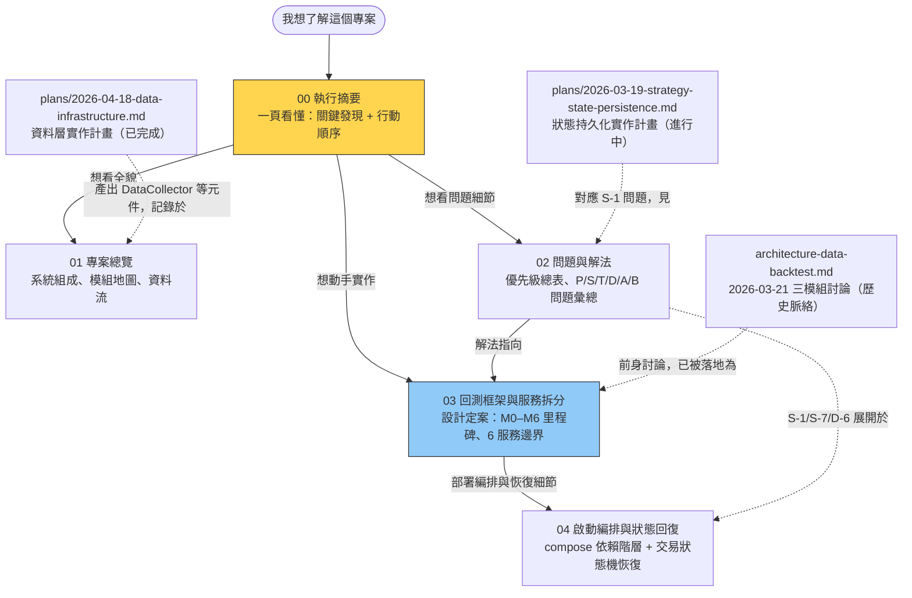

# 文件導覽（Docs Guide）

> 更新日期：2026-07-04

## 文件地圖

## 依你的目的選文件

| 你想做什麼 | 讀哪份 |
|-----------|--------|
| 5 分鐘掌握現況與下一步 | [00 執行摘要](00-executive-summary.md) |
| 了解系統長什麼樣（模組、資料流、進入點、測試現況） | [01 專案總覽](01-project-overview.md) |
| 查某個問題的根因與解法（如 P-1 格式斷裂、B-4 槓桿錯誤） | [02 問題與解法](02-issues-and-solutions.md) |
| 實作回測框架、或決定服務怎麼拆 | [03 回測框架與服務拆分](03-backtest-framework-and-service-split.md) |
| 搞清楚 compose 怎麼保證資料就緒、交易重啟後怎麼對帳恢復 | [04 啟動編排與狀態回復](04-startup-orchestration-and-state-recovery.md) |
| 追溯「為什麼這樣設計」的討論脈絡 | [architecture-data-backtest.md](architecture-data-backtest.md)（2026-03-21） |
| 逐步執行既有實作計畫 | `superpowers/plans/` 下兩份 plan |

## 文件關係與維護約定

- **00 是 01/02/03 的濃縮**：更新 01/02/03 的結論時，記得同步 00。
- **02 的解法只寫「方向」**，完整設計放 03——避免兩處重複、日後不同步。
- **問題編號系統**：`P-*` 是 2026-07-03 盤點新發現；`S/T/D/A/B-*` 沿用根目錄 `issue.md` 的編號（S 系統、T 策略、D 部署、A 架構、B bug）。`issue.md` 仍是歷史問題的原始台帳，02 是彙總與優先級視圖。
- **plans/ 下的文件是可執行的實作計畫**（checkbox 追蹤），完成後保留作為歷史紀錄，不再更新。

## 目前狀態速覽（2026-07-04）

- 分支 `feature/data-infrastructure`：資料層四階段已完成並提交
- 最高優先待辦：**修 P-1（producer 與 live_trading 訊息格式斷裂）**，見 02
- 你最想做的回測框架：設計已定案於 03，尚未動工（從 M0 開始）
